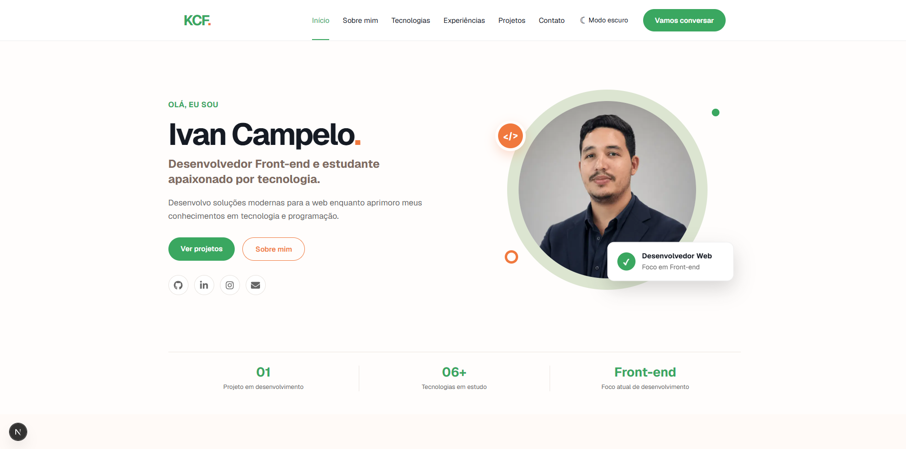

# Portfólio KCF

Portfólio pessoal desenvolvido para apresentar minha trajetória, experiências, tecnologias e projetos na área de desenvolvimento web.



## Sobre o projeto

Este projeto foi desenvolvido como parte da minha evolução no desenvolvimento Front-end.

Além de apresentar minhas informações profissionais, o portfólio também representa um exercício prático de desenvolvimento com React e Next.js, organização de componentes, responsividade, controle de versões e publicação de aplicações web.

## Funcionalidades

- Apresentação profissional
- Seção sobre mim
- Tecnologias utilizadas
- Experiências profissionais
- Projetos em destaque
- Links para redes sociais e contato
- Menu adaptado para dispositivos móveis
- Modo claro e modo escuro
- Tema salvo no navegador
- Layout responsivo

## Tecnologias

- HTML
- CSS
- JavaScript
- React
- Next.js
- Git
- GitHub
- React Icons

## Como executar o projeto

Primeiro, clone o repositório:

```bash
git clone https://github.com/ivankleyton/portfolio-kcf

Entre na pasta:

- cd portfolio-kcf

Instale as dependências:

- npm install

Execute o servidor de desenvolvimento:

- npm run dev

Depois, abra no navegador:

- http://localhost:3000

Verificações

Para executar o ESLint:

- npm run lint

Para gerar a versão de produção:

- npm run build

Para executar a versão de produção localmente:

- npm run start